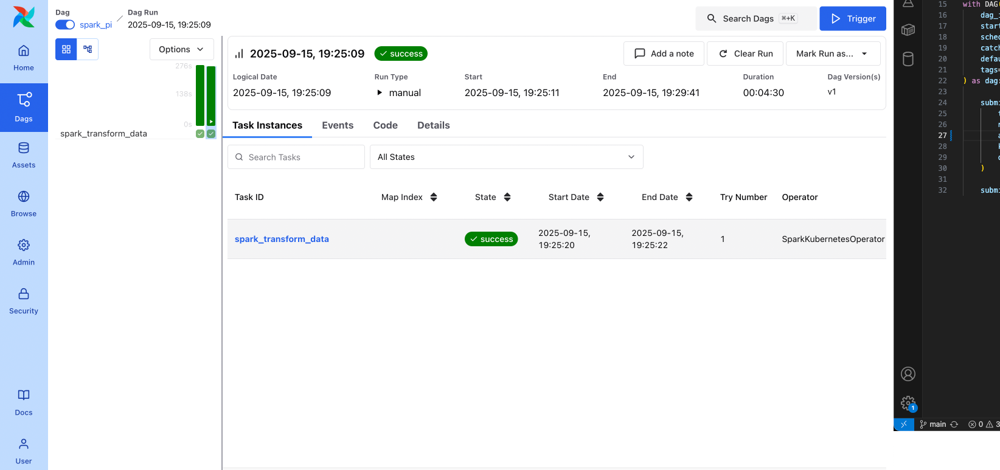
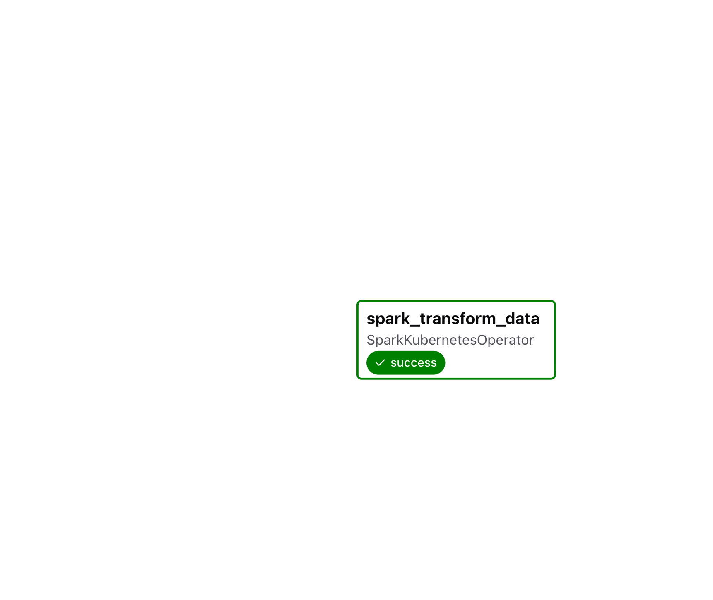

# ⚡ Orchestrating Spark on Kubernetes with Airflow

This project demonstrates how to orchestrate **Apache Spark jobs** on a **Kubernetes cluster** using **Apache Airflow**.  
Airflow DAGs are synced from a Git repository (via `git-sync`) and executed on demand through the Airflow UI.  

---

## 🚀 Setup & Workflow

1. ⚙️ **Deploy Airflow** with `KubernetesExecutor`
2. 🔄 **Enable git-sync** → DAGs auto-pulled from this repo
3. ☸️ **Install Spark Operator** via Helm to manage Spark applications
4. 🐳 Adjust `values.yaml` for:
   - Docker image configuration
   - KubernetesExecutor settings
   - Git-Sync sidecar
5. 🪄 Create a simple DAG (`spark_pi`) that submits a Spark job (`spark-pi.yaml`) to the `spark-operator` namespace
6. ▶️ Trigger the DAG from **Airflow UI** → Spark job executed successfully 🎉

---

## 📂 Project Structure

```bash
airflow-dags/
├── kubernetes/
│   └── spark-pi.yaml        # SparkApplication definition
├── dag_infrastructure_validation.py
└── README.md
```

---
## 📊 Demo

After configuring Airflow with KubernetesExecutor and Spark Operator,
we successfully submitted and monitored a Spark job from the Airflow UI.

<p align="center">
  
</p>

<p align="center">
  
</p>

---

🛠️ Key Technologies
	•	✈️ Apache Airflow (KubernetesExecutor, Git-Sync)
	•	☸️ Kubernetes (Kind cluster for local testing)
	•	🔥 Spark Operator (running Spark jobs as CRDs)
	•	🐳 Docker (base images for Airflow and Spark)


---

📝 How to Run

    1. Deploy Airflow with `KubernetesExecutor` and git-sync enabled  
      helm install airflow apache-airflow/airflow -f values.yaml

	2.	Install Spark Operator   
      helm install spark-operator spark-operator/spark-operator --namespace spark-operator

    3.	Add DAG and Spark YAML into the Airflow dags folder (auto-synced via git-sync).
	4.	Trigger DAG in Airflow UI → watch Spark job run in spark-operator namespace.

⸻
