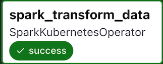

# Orchestrating Spark on Kubernetes with Airflow

This project demonstrates how to orchestrate **Apache Spark jobs** on a **Kubernetes cluster** using **Apache Airflow**.  
Airflow DAGs are synced from a Git repository (via `git-sync`) and executed on demand through the Airflow UI.

---

## Steps & Setup

- Deployed **Airflow** with `KubernetesExecutor`
- Configured **git-sync** so DAGs are automatically pulled from this repo
- Installed **Spark Operator** via Helm to manage Spark applications
- Adjusted `values.yaml` for:
  - Docker image configuration
  - KubernetesExecutor settings
  - Git-Sync sidecar
- Created a simple DAG (`spark_pi`) that submits a Spark job (`spark-pi.yaml`) to the `spark-operator` namespace
- Triggered the DAG from **Airflow UI** and successfully executed the Spark Pi job

---

## Project Structure
airflow-dags/
│
├── kubernetes/
│   └── spark-pi.yaml        # SparkApplication definition
├── dag_infrastructure_validation.py
└── README.md

---

## Demo

After configuring Airflow with KubernetesExecutor and Spark Operator,  
we successfully submitted and monitored a Spark job from the Airflow UI.  

### DAG Graph

### Task Success

---

## Key Technologies

- **Apache Airflow** (KubernetesExecutor, Git-Sync)
- **Kubernetes** (Kind cluster for local testing)
- **Spark Operator** (running Spark jobs as CRDs)
- **Docker** (base images for Airflow and Spark)

---

## Run It Yourself 

    1. Deploy Airflow with `KubernetesExecutor` and git-sync enabled  
      helm install airflow apache-airflow/airflow -f values.yaml

	2.	Install Spark Operator   
      helm install spark-operator spark-operator/spark-operator --namespace spark-operator

    3.	Add DAG and Spark YAML into the Airflow dags folder (auto-synced via git-sync).
	4.	Trigger DAG in Airflow UI → watch Spark job run in spark-operator namespace.

⸻
